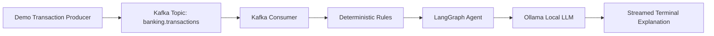

# Local Kafka + LangGraph Banking AI

This is a small local-first learning project for macOS on Apple Silicon. It shows how a Python producer writes fake banking transactions into Kafka, how a consumer reads them back, how deterministic inspection rules run first, and how a small LangGraph workflow streams a local Ollama explanation to the terminal.

This project is for learning. It is not a production banking system, fraud engine, security reference architecture, or scalable Kafka deployment.

## Why These Parts Exist

- Kafka is used because it teaches event streaming: a producer writes events into a named topic, and a consumer reads those events later.
- Ollama is used because it runs an LLM locally without API keys, cloud services, or external AI APIs.
- LangGraph is used because it makes the inspection flow explicit as small state transitions.
- Deterministic rules are used before the LLM because important decisions should not depend only on generated text.

## Architecture



The runtime flow is:

```text
producer -> Kafka topic -> consumer -> rules -> LangGraph -> Ollama -> streamed terminal output
```

Traceability from learning intent to code is maintained in [docs/traceability.md](docs/traceability.md). GitHub issue definitions and links for the main work topics are in [docs/github-issues.md](docs/github-issues.md). Runtime verification notes are in [docs/verification.md](docs/verification.md), and issue completion status is summarized in [docs/project-status.md](docs/project-status.md).

License transparency is documented in [LICENSE](LICENSE), [THIRD_PARTY_NOTICES.md](THIRD_PARTY_NOTICES.md), and [docs/license-review.md](docs/license-review.md). The project code is MIT licensed.

To create the GitHub issues from the local backlog after authenticating `gh`:

```bash
gh auth login
./scripts/create_github_issues.sh
```

## Learning Objective Traceability

Use [docs/traceability.md](docs/traceability.md) to trace each learning objective to implementation files, tests, verification commands, and GitHub issues.

| Learning objective | Trace |
| --- | --- |
| Kafka topic, producer, consumer, message key, message value, consumer group, offsets, and JSON payloads | [LI-001 to LI-003](docs/traceability.md#traceability-matrix) |
| Deterministic banking transaction inspection rules | [LI-004](docs/traceability.md#traceability-matrix) |
| Typed models for transaction, findings, inspection result, and graph state | [LI-005](docs/traceability.md#traceability-matrix) |
| LangGraph state flow | [LI-006](docs/traceability.md#traceability-matrix) |
| Local Ollama streaming without external AI APIs | [LI-007](docs/traceability.md#traceability-matrix) |
| Local macOS/Rancher Desktop run scripts and infrastructure-free tests | [LI-008 to LI-010](docs/traceability.md#traceability-matrix) |

## Quick Start

Use this path when you want to run the full example from a clean checkout on macOS.

1. Create and install the Python environment:

What you learn: Python project dependencies should be isolated in a disposable virtual environment, so this example does not depend on packages installed globally on your Mac. Official resource: [Python `venv` documentation](https://docs.python.org/3/library/venv.html).

```bash
python3 -m venv .venv
source .venv/bin/activate
pip install -e ".[dev]"
```

2. Start your local container runner, such as Rancher Desktop, Docker Desktop, or Colima.

What you learn: Kafka runs as a local container in this project, and Docker Compose is the small local orchestration layer that starts the broker. Official resource: [Docker Compose documentation](https://docs.docker.com/compose/).

3. Start Kafka and create the topic:

What you learn: Kafka stores events in named topics; `banking.transactions` is the stream that the producer writes to and the consumer reads from. Official resource: [Apache Kafka quickstart](https://kafka.apache.org/quickstart/).

```bash
./scripts/start.sh
sleep 10
PYTHON=.venv/bin/python ./scripts/create_topics.sh
```

4. Make sure Ollama is running and choose a local model:

What you learn: Ollama runs the LLM locally and exposes a local HTTP API, so the inspection explanation does not call an external AI service. Official resources: [Ollama API documentation](https://github.com/ollama/ollama/blob/main/docs/api.md) and [Ollama model library](https://ollama.com/library).

```bash
ollama serve
```

In another terminal:

```bash
export OLLAMA_MODEL=qwen3-coder:30b
```

If you want to use the default model instead:

```bash
ollama pull llama3.2
export OLLAMA_MODEL=llama3.2
```

5. Produce demo transactions:

What you learn: a Kafka producer writes a JSON message value to a topic and uses `transaction_id` as the message key. Official resource: [Apache Kafka quickstart](https://kafka.apache.org/quickstart/).

```bash
PYTHON=.venv/bin/python ./scripts/produce_demo_transactions.sh
```

6. Consume and inspect transactions with streamed terminal output:

What you learn: a Kafka consumer reads messages as part of a consumer group, the app applies deterministic rules first, LangGraph moves state through the inspection workflow, and Ollama streams explanation text back to the terminal. Official resources: [Apache Kafka quickstart](https://kafka.apache.org/quickstart/), [LangGraph overview](https://docs.langchain.com/oss/python/langgraph/overview), and [Ollama API documentation](https://github.com/ollama/ollama/blob/main/docs/api.md).

```bash
PYTHON=.venv/bin/python MAX_MESSAGES=10 ./scripts/consume_and_inspect.sh
```

7. Run the unit tests:

What you learn: the rule logic, model validation, and graph state behavior can be verified without Kafka, containers, Ollama, or network access. Official resource: [pytest documentation](https://docs.pytest.org/en/stable/).

```bash
.venv/bin/python -m pytest
```

## Clean Up

Stop and remove the local Kafka container and Docker Compose network:

What you learn: stopping the Compose stack removes this example's local Kafka runtime state because the project does not define a persistent Kafka volume. Official resource: [Docker Compose documentation](https://docs.docker.com/compose/).

```bash
./scripts/stop.sh
```

Leave Ollama installed, but stop `ollama serve` with `Ctrl+C` in the terminal where it is running.

What you learn: Ollama is a separate local runtime from Kafka; stopping Kafka does not stop the model server. Official resource: [Ollama documentation](https://github.com/ollama/ollama/tree/main/docs).

Remove the Python virtual environment if you want a fully clean local checkout:

What you learn: virtual environments are disposable and can be recreated from project metadata when needed. Official resource: [Python `venv` documentation](https://docs.python.org/3/library/venv.html).

```bash
deactivate
rm -rf .venv
```

Optional Docker image cleanup if you want to reclaim disk space:

What you learn: containers are runtime instances, while images are cached templates; removing the image forces your container runner to download it again later. Official resource: [Docker image documentation](https://docs.docker.com/get-started/docker-concepts/the-basics/what-is-an-image/).

```bash
docker rmi apache/kafka:3.8.1
```

This project does not define a persistent Kafka volume, so `./scripts/stop.sh` removes the Kafka container state for this example.

## Kafka Basics In This Project

- Topic: `banking.transactions` is the named stream of transaction events.
- Producer: `python -m banking_ai.producer` writes JSON transaction events into Kafka.
- Message key: the producer uses `transaction_id` as the Kafka key so related messages can be identified consistently.
- Message value: the transaction payload is serialized as JSON.
- Consumer: `python -m banking_ai.consumer` reads events from the topic.
- Consumer group: `banking-ai-inspector` lets Kafka coordinate which consumer instance reads which messages.
- Offset: Kafka tracks each consumer group's position in the topic. This example commits an offset only after a transaction was inspected successfully.

## Local AI Basics

Ollama runs the model on your machine. The consumer calls the local Ollama HTTP API at `http://localhost:11434/api/generate` and prints streamed text chunks as they arrive.

No OpenAI, Anthropic, Gemini, hosted LangSmith, hosted vector database, cloud Kafka, or API key is used.

Ollama models are not bundled with this repository. Check the license for any model you pull locally, such as `llama3.2` or `qwen3-coder:30b`, before redistributing model files or outputs in another project.

## Install Dependencies

Use Python 3.12 or newer.

```bash
python -m venv .venv
source .venv/bin/activate
pip install -e ".[dev]"
```

## Start Kafka

Start a local container runner such as Docker Desktop, Rancher Desktop, or Colima first.

```bash
./scripts/start.sh
PYTHON=.venv/bin/python ./scripts/create_topics.sh
```

The Kafka broker runs in KRaft mode, which means there is no ZooKeeper container.

The Python helper scripts use `${PYTHON:-python3}`. If your virtual environment is not activated, prefix them with `PYTHON=.venv/bin/python` as shown above.

## Start Ollama

Install Ollama from https://ollama.com if it is not installed yet.

In one terminal:

```bash
ollama serve
```

In another terminal:

```bash
ollama pull llama3.2
```

You can choose a different local model with:

```bash
export OLLAMA_MODEL=llama3.2
```

For example, the Rancher Desktop verification in this repository used an installed qwen 30B model:

```bash
export OLLAMA_MODEL=qwen3-coder:30b
```

## Produce Demo Transactions

```bash
PYTHON=.venv/bin/python ./scripts/produce_demo_transactions.sh
```

or, with an activated virtual environment:

```bash
python -m banking_ai.producer
```

The producer sends at least 10 predefined fake transactions. Some are normal and some are suspicious.

## Consume And Inspect Transactions

```bash
PYTHON=.venv/bin/python MAX_MESSAGES=10 ./scripts/consume_and_inspect.sh
```

or, with an activated virtual environment:

```bash
python -m banking_ai.consumer --max-messages 10
```

Example output shape:

```text
Received transaction: txn-1004

Rule findings:
- amount_greater_than_1000
- foreign_country

AI inspection:
This transaction should be reviewed because ...

Final result:
SUSPICIOUS
```

## Offsets And Consumer Groups

The consumer uses the group id `banking-ai-inspector`. Kafka stores the group's offset, which is the position of the next message the group should read.

This example disables automatic offset commits and commits manually after a transaction has been inspected. That keeps the learning point clear: the offset is advanced only after the work for a message succeeds.

If you run the same consumer group again after all messages were committed, it may not read old messages. To replay from the beginning while learning, change `CONSUMER_GROUP_ID` to a new value:

```bash
export CONSUMER_GROUP_ID=banking-ai-inspector-run-2
python -m banking_ai.consumer --max-messages 10
```

## Configuration

Defaults are local and beginner-friendly:

```bash
KAFKA_BOOTSTRAP_SERVERS=localhost:9092
TRANSACTION_TOPIC=banking.transactions
INSPECTION_TOPIC=banking.transaction.inspections
OLLAMA_BASE_URL=http://localhost:11434
OLLAMA_MODEL=llama3.2
CONSUMER_GROUP_ID=banking-ai-inspector
```

Copy `.env.example` if you want a local reference file. The Python code reads environment variables directly.

## Run Tests

The unit tests do not require Docker, Kafka, Ollama, or network access.

```bash
pytest
```

## Stop Kafka

```bash
./scripts/stop.sh
```

## Troubleshooting

Kafka is not reachable:

```bash
./scripts/start.sh
PYTHON=.venv/bin/python ./scripts/create_topics.sh
```

Check that your local container runner is running and that port `9092` is free.

Ollama is not reachable:

```bash
ollama serve
```

Model is missing:

```bash
ollama pull llama3.2
```

Consumer reads no messages:

- The messages may already be committed for the current consumer group.
- Try a new group id with `export CONSUMER_GROUP_ID=banking-ai-inspector-run-2`.
- Produce demo transactions again.

Python cannot import `banking_ai`:

```bash
source .venv/bin/activate
pip install -e ".[dev]"
```

If you do not activate the virtual environment, run the project scripts with:

```bash
PYTHON=.venv/bin/python ./scripts/create_topics.sh
PYTHON=.venv/bin/python ./scripts/produce_demo_transactions.sh
PYTHON=.venv/bin/python MAX_MESSAGES=10 ./scripts/consume_and_inspect.sh
```

## Learning Exercises

- Add the optional topic `banking.transaction.inspections` and publish final inspection results to it.
- Add one more deterministic rule and a unit test for it.
- Change `CONSUMER_GROUP_ID` and observe how offset behavior changes.
- Add another consumer in the same group and observe how Kafka coordinates reads.
- Extend the LangGraph state with a reviewer note.
- Compare two local Ollama models and observe speed and explanation differences.
