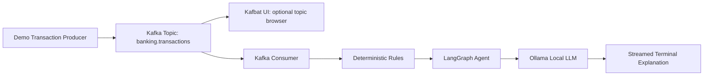

# Local Kafka + LangGraph Banking AI

[](https://github.com/thomassuedbroecker/simple_kafka_example/actions/workflows/tests.yml)

This is a small local-first learning project for macOS on Apple Silicon. It shows how a Python producer writes fake banking transactions into Kafka, how a consumer reads them back, how deterministic inspection rules run first, and how a small LangGraph workflow streams a local Ollama explanation to the terminal.

This project is for learning. It is not a production banking system, fraud engine, security reference architecture, or scalable Kafka deployment.

## Objective

Run one complete local example and understand this flow:

```text
producer -> Kafka topic -> consumer -> rules -> LangGraph -> Ollama -> streamed terminal output
```

By the end, you should be able to explain:

- Kafka topic, producer, consumer, message key, message value, consumer group, offset, and JSON payload basics.
- How Kafbat UI can show the topic, messages, consumer group, and offsets visually.
- Why deterministic transaction rules run before the LLM explanation.
- How LangGraph moves inspection state through small workflow nodes.
- Where Ollama streams local AI output in the terminal.
- Why this project does not need external AI APIs, cloud services, or API keys.

## Expected Result

After setup, the important successful output is:

```text
Produced 10 demo transactions.

Received transaction: txn-1001

Rule findings:
- none

AI inspection:
This transaction looks normal because ...

Final result:
NORMAL
```

Suspicious transactions should show triggered rules before the AI explanation:

```text
Received transaction: txn-1010

Rule findings:
- amount_greater_than_1000
- foreign_country
- suspicious_merchant_keyword

AI inspection:
This transaction should be reviewed because ...

Final result:
SUSPICIOUS
```

## Architecture



## Run The Example

Use this order from a clean checkout. If you run the consumer before producing transactions, there is nothing to inspect.

### 1. Install Dependencies

What you learn: Python project dependencies should be isolated in a disposable virtual environment. Official resource: [Python `venv` documentation](https://docs.python.org/3/library/venv.html).

```bash
python3 -m venv .venv
source .venv/bin/activate
pip install -e ".[dev]"
```

### 2. Start Kafka And Kafbat UI

Start your local container runner first, such as Rancher Desktop, Docker Desktop, or Colima.

What you learn: Kafka runs as a local container in this project, Docker Compose starts the broker, and Kafbat UI gives you a visual read-only way to inspect the learning flow. Official resources: [Docker Compose documentation](https://docs.docker.com/compose/), [Apache Kafka quickstart](https://kafka.apache.org/quickstart/), and [Kafbat UI documentation](https://ui.docs.kafbat.io/).

```bash
./scripts/start.sh
sleep 10
PYTHON=.venv/bin/python ./scripts/create_topics.sh
```

Expected result:

```text
Container local-kafka-langgraph-banking-ai-kafka Running
Container local-kafka-langgraph-banking-ai-kafbat-ui Running
Created topic: banking.transactions
```

or:

```text
Topic already exists: banking.transactions
```

The Kafka broker runs in KRaft mode, which means there is no ZooKeeper container.

Open Kafbat UI at:

```text
http://localhost:8080
```

Expected UI result: a cluster named `local-kafka`.

### 3. Start Ollama

Install Ollama from https://ollama.com if it is not installed yet.

What you learn: Ollama runs the LLM locally and exposes a local HTTP API, so the inspection explanation does not call an external AI service. Official resources: [Ollama API documentation](https://github.com/ollama/ollama/blob/main/docs/api.md) and [Ollama model library](https://ollama.com/library).

In one terminal:

```bash
ollama serve
```

In another terminal, choose a local model. The default model is `llama3.2`:

```bash
ollama pull llama3.2
export OLLAMA_MODEL=llama3.2
```

The local Rancher Desktop verification also worked with this installed qwen 30B model:

```bash
export OLLAMA_MODEL=qwen3-coder:30b
```

### 4. Produce Demo Transactions

What you learn: a Kafka producer writes a JSON message value to a topic and uses `transaction_id` as the message key.

```bash
PYTHON=.venv/bin/python ./scripts/produce_demo_transactions.sh
```

Expected result:

```text
Queued transaction txn-1001: {...}
...
Sent key=txn-1010 topic=banking.transactions partition=0 offset=9
Produced 10 demo transactions.
```

### 5. Inspect Kafka In Kafbat UI

What you learn: Kafka messages remain in the topic, and a UI can help you connect the terminal commands to Kafka concepts.

Open:

```text
http://localhost:8080
```

Look for:

- Cluster: `local-kafka`
- Topic: `banking.transactions`
- Messages: JSON transaction payloads
- Key: `transaction_id`, such as `txn-1001`
- Partition: `0` in this single-partition learning setup

After running the consumer in the next step, also inspect:

- Consumer group: `banking-ai-inspector`
- Offsets: the committed position after inspected messages

Kafbat UI is only for learning visibility here. The application still works from the terminal without using the UI.

### 6. Consume And Inspect Transactions

What you learn: a Kafka consumer reads messages as part of a consumer group, the app applies deterministic rules first, LangGraph moves state through the inspection workflow, and Ollama streams explanation text back to the terminal. Official resource: [LangGraph overview](https://docs.langchain.com/oss/python/langgraph/overview).

```bash
PYTHON=.venv/bin/python MAX_MESSAGES=10 ./scripts/consume_and_inspect.sh
```

Expected normal transaction output:

```text
Consuming from topic 'banking.transactions' with group 'banking-ai-inspector'.

Received transaction: txn-1001

Rule findings:
- none

AI inspection:
This transaction looks normal because ...

Final result:
NORMAL
Reviewer check: No deterministic rule was triggered; spot-check normal account context if needed.
```

Expected suspicious transaction output:

```text
Received transaction: txn-1010

Rule findings:
- amount_greater_than_1000
- foreign_country
- suspicious_merchant_keyword

AI inspection:
This transaction should be reviewed because ...

Final result:
SUSPICIOUS
Reviewer check: Review the triggered rule fields and compare the transaction with normal customer behavior.
```

If no messages arrive, the script stops after the demo idle timeout:

```text
No Kafka messages arrived within 30 seconds.
Run the producer first with: PYTHON=.venv/bin/python ./scripts/produce_demo_transactions.sh
If you already consumed these messages, use a new CONSUMER_GROUP_ID to replay them.
```

### 7. Run Tests

What you learn: the rule logic, model validation, Kafka config, and graph state behavior can be verified without Kafka, containers, Ollama, or network access. Official resource: [pytest documentation](https://docs.pytest.org/en/stable/).

```bash
.venv/bin/python -m pytest
```

Expected result:

```text
10 passed
```

The [Tests workflow](.github/workflows/tests.yml) runs two independent gates:

| Gate | Command | What it proves |
| --- | --- | --- |
| Python unit tests | `python -m pytest` | Rules, Pydantic models, LangGraph state flow, fake Ollama streaming, and local Kafka client config work without Docker, Kafka, Ollama, or network access. |
| Docker Compose configuration | `docker compose config` | The Kafka and Kafbat UI Compose configuration is syntactically valid and renders the intended services, ports, and listener settings. |

## Clean Up

Stop and remove the local Kafka container and Docker Compose network:

```bash
./scripts/stop.sh
```

Stop `ollama serve` with `Ctrl+C` in the terminal where it is running.

Remove the Python virtual environment if you want a fully clean local checkout:

```bash
deactivate
rm -rf .venv
```

Optional Docker image cleanup if you want to reclaim disk space:

```bash
docker rmi apache/kafka:3.8.1
```

This project does not define a persistent Kafka volume. After `./scripts/stop.sh`, the topic is empty until you start Kafka and produce transactions again.

## Learning Concepts

### Why These Parts Exist

- Kafka teaches event streaming: a producer writes events into a named topic, and a consumer reads those events later.
- Kafbat UI helps you see the topic, messages, consumer group, partitions, and offsets while learning.
- Ollama runs an LLM locally without API keys, cloud services, or external AI APIs.
- LangGraph makes the inspection flow explicit as small state transitions.
- Deterministic rules run before the LLM because important decisions should not depend only on generated text.

### Kafka Basics In This Project

- Topic: `banking.transactions` is the named stream of transaction events.
- Producer: `python -m banking_ai.producer` writes JSON transaction events into Kafka.
- Message key: the producer uses `transaction_id` as the Kafka key so related messages can be identified consistently.
- Message value: the transaction payload is serialized as JSON.
- Consumer: `python -m banking_ai.consumer` reads events from the topic.
- Consumer group: `banking-ai-inspector` lets Kafka coordinate which consumer instance reads which messages.
- Offset: Kafka tracks each consumer group's position in the topic. This example commits an offset only after a transaction was inspected successfully.
- Kafbat UI: `http://localhost:8080` shows the local Kafka cluster, topic, messages, consumer group, and offsets.

### Offsets And Consumer Groups

The consumer uses the group id `banking-ai-inspector`. Kafka stores the group's offset, which is the position of the next message the group should read.

This example disables automatic offset commits and commits manually after a transaction has been inspected. That keeps the learning point clear: the offset is advanced only after the work for a message succeeds.

If you run the same consumer group again after all messages were committed, it may not read old messages. To replay from the beginning while learning, change `CONSUMER_GROUP_ID` to a new value:

```bash
export CONSUMER_GROUP_ID=banking-ai-inspector-run-2
python -m banking_ai.consumer --max-messages 10 --idle-timeout-seconds 30
```

### Local AI Basics

Ollama runs the model on your machine. The consumer calls the local Ollama HTTP API at `http://localhost:11434/api/generate` and prints streamed text chunks as they arrive.

No OpenAI, Anthropic, Gemini, hosted LangSmith, hosted vector database, cloud Kafka, or API key is used.

Ollama models are not bundled with this repository. Check the license for any model you pull locally, such as `llama3.2` or `qwen3-coder:30b`, before redistributing model files or outputs in another project.

## Configuration

Defaults are local and beginner-friendly:

```bash
KAFKA_BOOTSTRAP_SERVERS=localhost:9092
TRANSACTION_TOPIC=banking.transactions
INSPECTION_TOPIC=banking.transaction.inspections
OLLAMA_BASE_URL=http://localhost:11434
OLLAMA_MODEL=llama3.2
CONSUMER_GROUP_ID=banking-ai-inspector
```

Kafbat UI is configured in Docker Compose with:

```bash
KAFKA_CLUSTERS_0_NAME=local-kafka
KAFKA_CLUSTERS_0_BOOTSTRAPSERVERS=kafka:29092
```

Copy `.env.example` if you want a local reference file. The Python code reads environment variables directly.

The Python helper scripts use `${PYTHON:-python3}`. If your virtual environment is not activated, prefix them with `PYTHON=.venv/bin/python`.

## Documentation And Traceability

Traceability from learning intent to code is maintained in [docs/traceability.md](docs/traceability.md). GitHub issue definitions and links for the main work topics are in [docs/github-issues.md](docs/github-issues.md). Runtime verification notes are in [docs/verification.md](docs/verification.md), and issue completion status is summarized in [docs/project-status.md](docs/project-status.md).

License transparency is documented in [LICENSE](LICENSE), [THIRD_PARTY_NOTICES.md](THIRD_PARTY_NOTICES.md), and [docs/license-review.md](docs/license-review.md). The project code is MIT licensed.

## Troubleshooting

Kafka is not reachable:

```bash
./scripts/start.sh
PYTHON=.venv/bin/python ./scripts/create_topics.sh
```

Check that your local container runner is running and that port `9092` is free.

Kafbat UI is not reachable:

```bash
docker compose ps
docker compose logs kafbat-ui
```

Check that port `8080` is free and open `http://localhost:8080`.

Ollama is not reachable:

```bash
ollama serve
```

Model is missing:

```bash
ollama pull llama3.2
```

Consumer reads no messages:

- Make sure you ran `PYTHON=.venv/bin/python ./scripts/produce_demo_transactions.sh` after the most recent `./scripts/start.sh`.
- The messages may already be committed for the current consumer group.
- Try a new group id with `export CONSUMER_GROUP_ID=banking-ai-inspector-run-2`.
- Produce demo transactions again.

Python cannot import `banking_ai`:

```bash
source .venv/bin/activate
pip install -e ".[dev]"
```

## Learning Exercises

- Add the optional topic `banking.transaction.inspections` and publish final inspection results to it.
- Add one more deterministic rule and a unit test for it.
- Change `CONSUMER_GROUP_ID` and observe how offset behavior changes.
- Add another consumer in the same group and observe how Kafka coordinates reads.
- Extend the LangGraph state with a reviewer note.
- Compare two local Ollama models and observe speed and explanation differences.
