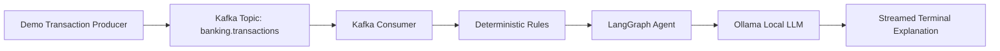

# Local Kafka + LangGraph Banking AI

This is a small local-first learning project for macOS on Apple Silicon. It shows how a Python producer writes fake banking transactions into Kafka, how a consumer reads them back, how deterministic inspection rules run first, and how a small LangGraph workflow streams a local Ollama explanation to the terminal.

This project is for learning. It is not a production banking system, fraud engine, security reference architecture, or scalable Kafka deployment.

## Why These Parts Exist

- Kafka is used because it teaches event streaming: a producer writes events into a named topic, and a consumer reads those events later.
- Ollama is used because it runs an LLM locally without API keys, cloud services, or external AI APIs.
- LangGraph is used because it makes the inspection flow explicit as small state transitions.
- Deterministic rules are used before the LLM because important decisions should not depend only on generated text.

## Architecture



The runtime flow is:

```text
producer -> Kafka topic -> consumer -> rules -> LangGraph -> Ollama -> streamed terminal output
```

Traceability from learning intent to code is maintained in [docs/traceability.md](docs/traceability.md). GitHub issue definitions and links for the main work topics are in [docs/github-issues.md](docs/github-issues.md). Runtime verification notes are in [docs/verification.md](docs/verification.md).

To create the GitHub issues from the local backlog after authenticating `gh`:

```bash
gh auth login
./scripts/create_github_issues.sh
```

## Kafka Basics In This Project

- Topic: `banking.transactions` is the named stream of transaction events.
- Producer: `python -m banking_ai.producer` writes JSON transaction events into Kafka.
- Message key: the producer uses `transaction_id` as the Kafka key so related messages can be identified consistently.
- Message value: the transaction payload is serialized as JSON.
- Consumer: `python -m banking_ai.consumer` reads events from the topic.
- Consumer group: `banking-ai-inspector` lets Kafka coordinate which consumer instance reads which messages.
- Offset: Kafka tracks each consumer group's position in the topic. This example commits an offset only after a transaction was inspected successfully.

## Local AI Basics

Ollama runs the model on your machine. The consumer calls the local Ollama HTTP API at `http://localhost:11434/api/generate` and prints streamed text chunks as they arrive.

No OpenAI, Anthropic, Gemini, hosted LangSmith, hosted vector database, cloud Kafka, or API key is used.

## Install Dependencies

Use Python 3.12 or newer.

```bash
python -m venv .venv
source .venv/bin/activate
pip install -e ".[dev]"
```

## Start Kafka

Start a local container runner such as Docker Desktop, Rancher Desktop, or Colima first.

```bash
./scripts/start.sh
./scripts/create_topics.sh
```

The Kafka broker runs in KRaft mode, which means there is no ZooKeeper container.

## Start Ollama

Install Ollama from https://ollama.com if it is not installed yet.

In one terminal:

```bash
ollama serve
```

In another terminal:

```bash
ollama pull llama3.2
```

You can choose a different local model with:

```bash
export OLLAMA_MODEL=llama3.2
```

## Produce Demo Transactions

```bash
python -m banking_ai.producer
```

or:

```bash
./scripts/produce_demo_transactions.sh
```

The producer sends at least 10 predefined fake transactions. Some are normal and some are suspicious.

## Consume And Inspect Transactions

```bash
python -m banking_ai.consumer --max-messages 10
```

or:

```bash
./scripts/consume_and_inspect.sh
```

Example output shape:

```text
Received transaction: txn-1004

Rule findings:
- amount_greater_than_1000
- foreign_country

AI inspection:
This transaction should be reviewed because ...

Final result:
SUSPICIOUS
```

## Offsets And Consumer Groups

The consumer uses the group id `banking-ai-inspector`. Kafka stores the group's offset, which is the position of the next message the group should read.

This example disables automatic offset commits and commits manually after a transaction has been inspected. That keeps the learning point clear: the offset is advanced only after the work for a message succeeds.

If you run the same consumer group again after all messages were committed, it may not read old messages. To replay from the beginning while learning, change `CONSUMER_GROUP_ID` to a new value:

```bash
export CONSUMER_GROUP_ID=banking-ai-inspector-run-2
python -m banking_ai.consumer --max-messages 10
```

## Configuration

Defaults are local and beginner-friendly:

```bash
KAFKA_BOOTSTRAP_SERVERS=localhost:9092
TRANSACTION_TOPIC=banking.transactions
INSPECTION_TOPIC=banking.transaction.inspections
OLLAMA_BASE_URL=http://localhost:11434
OLLAMA_MODEL=llama3.2
CONSUMER_GROUP_ID=banking-ai-inspector
```

Copy `.env.example` if you want a local reference file. The Python code reads environment variables directly.

## Run Tests

The unit tests do not require Docker, Kafka, Ollama, or network access.

```bash
pytest
```

## Stop Kafka

```bash
./scripts/stop.sh
```

## Troubleshooting

Kafka is not reachable:

```bash
./scripts/start.sh
./scripts/create_topics.sh
```

Check that your local container runner is running and that port `9092` is free.

Ollama is not reachable:

```bash
ollama serve
```

Model is missing:

```bash
ollama pull llama3.2
```

Consumer reads no messages:

- The messages may already be committed for the current consumer group.
- Try a new group id with `export CONSUMER_GROUP_ID=banking-ai-inspector-run-2`.
- Produce demo transactions again.

Python cannot import `banking_ai`:

```bash
source .venv/bin/activate
pip install -e ".[dev]"
```

## Learning Exercises

- Add the optional topic `banking.transaction.inspections` and publish final inspection results to it.
- Add one more deterministic rule and a unit test for it.
- Change `CONSUMER_GROUP_ID` and observe how offset behavior changes.
- Add another consumer in the same group and observe how Kafka coordinates reads.
- Extend the LangGraph state with a reviewer note.
- Compare two local Ollama models and observe speed and explanation differences.
