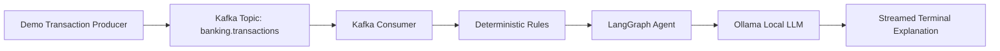

Assuming you mean: generate the improved full prompt for your `prompts/initial_prompt.md`.

```markdown
You are a senior Python developer and software architect.

Build a small local-first learning project for macOS M3.

# Objective

Create a simple but structured learning application to understand Kafka basics and combine them with local AI streaming.

The primary goal is learning by implementing a working example, not building a production system.

The application must demonstrate:

1. Basic Kafka concepts
   - topic
   - producer
   - consumer
   - message key
   - message value
   - consumer group
   - offset basics
   - JSON event payloads

2. A simple banking transaction inspection use case
   - Generate fake banking transaction events.
   - Send them to Kafka.
   - Consume them from Kafka.
   - Inspect them with deterministic rules.
   - Use a small LangGraph workflow to structure the inspection.
   - Use Ollama locally to generate a plain-language explanation.
   - Stream the AI inspection result back to the terminal.

3. Local-only AI execution
   - Use Ollama running locally.
   - Do not call external AI APIs.
   - Do not use cloud services.
   - Do not require API keys.

# Learning Intent

Optimize for:

- beginner-readable code
- small modules
- explicit data flow
- clear terminal output
- comments where they explain Kafka, LangGraph, or Ollama concepts
- minimal moving parts
- local execution on macOS M3

Do not optimize for:

- production architecture
- enterprise security
- scalability
- advanced Kafka tuning
- complex agent behavior
- generic frameworks
- premature abstraction

Every file and function should help explain why that part is needed.

If a feature does not teach Kafka basics, local AI streaming, deterministic inspection rules, or LangGraph state flow, leave it out or mention it as a README learning exercise.

# Target Environment

The target machine is:

- macOS on Apple Silicon M3
- local development only
- Python as programming language
- containers running locally
- Ollama as local inference runtime
- Kafka running in local containers

Use Docker Compose syntax.

The documentation should refer to a local container runtime. If the user wrote “ranker for the containers”, interpret that as “runner for the containers”.

# Core Stack

Use:

- Python 3.12+
- Apache Kafka in a local container
- one Kafka broker in KRaft mode, without ZooKeeper
- confluent-kafka Python client
- LangGraph
- Ollama
- direct Ollama HTTP API calls via `httpx`
- Pydantic v2 for typed models
- default local Ollama model: `llama3.2`

Do not use:

- OpenAI API
- Anthropic API
- Gemini API
- hosted LangSmith
- hosted vector databases
- cloud Kafka
- authentication
- real banking data
- production security complexity

# Simplicity Decisions

Keep the implementation intentionally simple.

This is not a production banking system.
This is a local learning example.

Use one main Kafka topic:

- `banking.transactions`

Mention this optional topic only as a learning exercise unless it is trivial to add:

- `banking.transaction.inspections`

Use:

- one producer command
- one consumer command
- predefined fake transactions only
- deterministic rules before the LLM explanation
- a small real LangGraph `StateGraph`
- streaming terminal output from Ollama where possible

The application should make this flow clear:

```text
transaction producer
    -> Kafka topic
    -> transaction consumer
    -> deterministic rules
    -> LangGraph inspection workflow
    -> Ollama local LLM
    -> streamed terminal output
```

# Teaching Requirement

The README and code should explain why each part exists:

- Kafka topic: the named stream of transaction events
- Producer: writes events into Kafka
- Message key: uses `transaction_id` to identify related messages
- Message value: JSON transaction payload
- Consumer group: lets consumers coordinate reading
- Offset: tracks which messages were already consumed
- Rules: deterministic first-pass inspection
- LangGraph: organizes the inspection workflow as state transitions
- Ollama: provides local LLM explanation without external APIs
- Streaming: shows tokens progressively in the terminal

A beginner should be able to read the README, run the commands, and explain the flow:

```text
producer -> Kafka topic -> consumer -> rules -> LangGraph -> Ollama -> streamed terminal output
```

# Use Case

Create fake banking transaction events.

Example transaction event:

```json
{
  "transaction_id": "txn-1001",
  "account_id": "acc-001",
  "amount": 249.99,
  "currency": "EUR",
  "merchant": "Online Electronics Store",
  "country": "DE",
  "timestamp": "2026-06-10T10:15:00Z",
  "transaction_type": "card_payment"
}
```

The inspection should answer:

- Is the transaction normal or suspicious?
- Why?
- Which fields were relevant?
- Which simple rule was triggered?
- What should a human reviewer check?

Use these deterministic rules before calling the LLM:

- `amount > 1000` -> suspicious
- `country not in ["DE", "NL", "FR", "AT"]` -> suspicious
- `transaction_type == "cash_withdrawal" and amount > 500` -> suspicious
- merchant contains words like `"crypto"`, `"casino"`, or `"unknown"` -> suspicious

The LangGraph workflow should combine:

1. deterministic rule result
2. local LLM explanation via Ollama
3. streamed output to the terminal

# Required Project Structure

Create this project structure:

```text
local-kafka-langgraph-banking-ai/
├── README.md
├── docker-compose.yml
├── pyproject.toml
├── .env.example
├── src/
│   └── banking_ai/
│       ├── __init__.py
│       ├── config.py
│       ├── models.py
│       ├── kafka_admin.py
│       ├── producer.py
│       ├── consumer.py
│       ├── rules.py
│       ├── ollama_client.py
│       ├── graph.py
│       └── cli.py
├── scripts/
│   ├── start.sh
│   ├── stop.sh
│   ├── create_topics.sh
│   ├── produce_demo_transactions.sh
│   └── consume_and_inspect.sh
└── tests/
    ├── test_rules.py
    ├── test_models.py
    └── test_graph_state.py
```

If the implementation is being created inside an existing repository, create the files in this structure without adding unnecessary extra nesting.

# Kafka Requirements

Create a local Kafka setup with:

- one Kafka broker
- KRaft mode
- no ZooKeeper
- one required topic: `banking.transactions`
- optional learning exercise topic: `banking.transaction.inspections`

Kafka should be easy to start with:

```bash
./scripts/start.sh
```

And easy to stop with:

```bash
./scripts/stop.sh
```

The application must provide a topic creation step:

```bash
./scripts/create_topics.sh
```

# Python Application Requirements

## config.py

Centralize configuration:

- Kafka bootstrap servers
- transaction topic name
- optional inspection topic name
- Ollama base URL
- Ollama model name
- consumer group id

Read from environment variables with sensible local defaults.

Default values:

- `KAFKA_BOOTSTRAP_SERVERS=localhost:9092`
- `TRANSACTION_TOPIC=banking.transactions`
- `INSPECTION_TOPIC=banking.transaction.inspections`
- `OLLAMA_BASE_URL=http://localhost:11434`
- `OLLAMA_MODEL=llama3.2`
- `CONSUMER_GROUP_ID=banking-ai-inspector`

## models.py

Define typed data models using Pydantic v2.

Models:

- `BankingTransaction`
- `RuleFinding`
- `InspectionResult`
- `AgentState`

Keep the models simple and readable.

## producer.py

Create a Kafka producer that sends demo banking transaction events.

Requirements:

- produce at least 10 predefined sample transactions
- include normal and suspicious examples
- serialize messages as JSON
- use `transaction_id` as Kafka message key
- print what was sent

Command:

```bash
python -m banking_ai.producer
```

## consumer.py

Create a Kafka consumer that reads transaction events.

Requirements:

- subscribe to `banking.transactions`
- deserialize JSON
- pass each transaction to the LangGraph inspection workflow
- stream the inspection result to the terminal
- commit offsets only after successful inspection if possible
- support `--max-messages` so demos can terminate predictably
- keep the implementation simple and readable

Commands:

```bash
python -m banking_ai.consumer
python -m banking_ai.consumer --max-messages 10
```

## rules.py

Implement deterministic inspection rules.

Function:

```python
inspect_transaction_rules(transaction: BankingTransaction) -> list[RuleFinding]
```

Rules must be easy to read and beginner-friendly.

## ollama_client.py

Implement a minimal local Ollama client.

Requirements:

- use `httpx`
- call the local Ollama API directly
- default URL: `http://localhost:11434`
- use `/api/generate`
- support streaming responses
- do not require API keys
- do not call external APIs
- handle the case where Ollama is not running
- handle the case where the model is missing
- provide clear error messages

If Ollama is unavailable, AI inspection commands should fail with a clear explanation rather than silently pretending that AI was used.

## graph.py

Build a simple LangGraph workflow using a real `StateGraph`.

The graph should have these conceptual nodes:

1. `load_transaction`
2. `apply_rules`
3. `generate_ai_explanation`
4. `finalize_result`

The state should contain:

- transaction
- rule findings
- suspicious flag
- AI explanation text
- final inspection result

The graph does not need to be complex.
The goal is learning.

The workflow should make it easy to understand how data moves from one step to the next.

The AI explanation should be streamed from Ollama where possible.

## cli.py

Keep this optional and minimal.

Do not build a full CLI framework unless it makes the learning flow clearer.

The main supported commands are:

```bash
python -m banking_ai.producer
python -m banking_ai.consumer
```

# Streaming Requirement

The consumer must show AI output progressively in the terminal.

Example terminal output:

```text
Received transaction: txn-1004

Rule findings:
- amount_greater_than_1000
- foreign_country

AI inspection:
This transaction should be reviewed because ...

Final result:
SUSPICIOUS
```

# Scripts

Create simple shell scripts using bash with:

```bash
set -euo pipefail
```

Scripts:

- `scripts/start.sh`: starts Kafka with Docker Compose
- `scripts/stop.sh`: stops Kafka
- `scripts/create_topics.sh`: creates the Kafka topic
- `scripts/produce_demo_transactions.sh`: runs the producer module
- `scripts/consume_and_inspect.sh`: runs the consumer module

# Tests

Create focused unit tests.

Tests should cover:

- deterministic rule behavior
- model validation
- graph state creation or state transition behavior

Tests must not require:

- Docker
- Kafka
- Ollama
- network access

Use `pytest`.

# README Requirements

Create a strong README.md.

The README must explain:

1. What this project is
2. What this project is not
3. Why Kafka is used
4. Why Ollama is used
5. Why LangGraph is used
6. Architecture overview
7. Kafka basics explained simply
8. Local AI basics explained simply
9. How to install dependencies
10. How to start Kafka
11. How to create the Kafka topic
12. How to start Ollama
13. How to pull a local Ollama model
14. How to produce demo transactions
15. How to consume and inspect transactions
16. How offsets and consumer groups appear in this example
17. Troubleshooting
18. Learning exercises

Include commands such as:

```bash
python -m venv .venv
source .venv/bin/activate
pip install -e ".[dev]"

ollama serve
ollama pull llama3.2

./scripts/start.sh
./scripts/create_topics.sh

python -m banking_ai.producer
python -m banking_ai.consumer --max-messages 10

pytest
./scripts/stop.sh
```

# README Architecture Diagram

Include this Mermaid diagram:



# Acceptance Criteria

The implementation is complete when:

- `./scripts/start.sh` starts local Kafka.
- `./scripts/create_topics.sh` creates `banking.transactions`.
- `python -m banking_ai.producer` sends at least 10 JSON transactions.
- The Kafka message key is `transaction_id`.
- `python -m banking_ai.consumer --max-messages 10` consumes transactions.
- The consumer prints rule findings.
- The consumer streams the Ollama explanation progressively.
- Suspicious transactions are flagged by deterministic rules before the LLM explanation is generated.
- No external AI APIs, cloud services, hosted tracing, or API keys are used.
- `pytest` passes without requiring Kafka or Ollama.
- The README explains why each component exists.

# Verification Commands

After implementation, verify with:

```bash
python -m venv .venv
source .venv/bin/activate
pip install -e ".[dev]"

pytest

./scripts/start.sh
./scripts/create_topics.sh

ollama serve
ollama pull llama3.2

python -m banking_ai.producer
python -m banking_ai.consumer --max-messages 10

./scripts/stop.sh
```

If a verification step cannot be run, clearly state why and what was verified instead.
```
